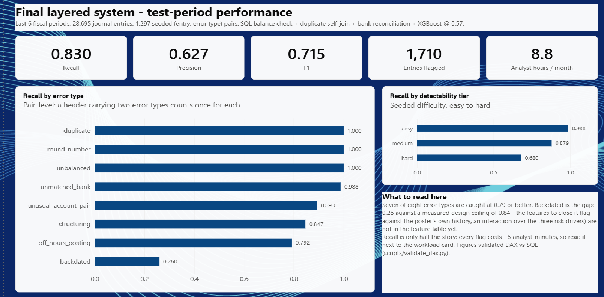
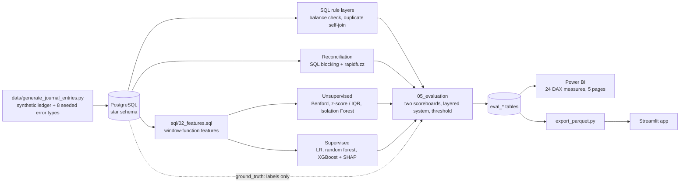
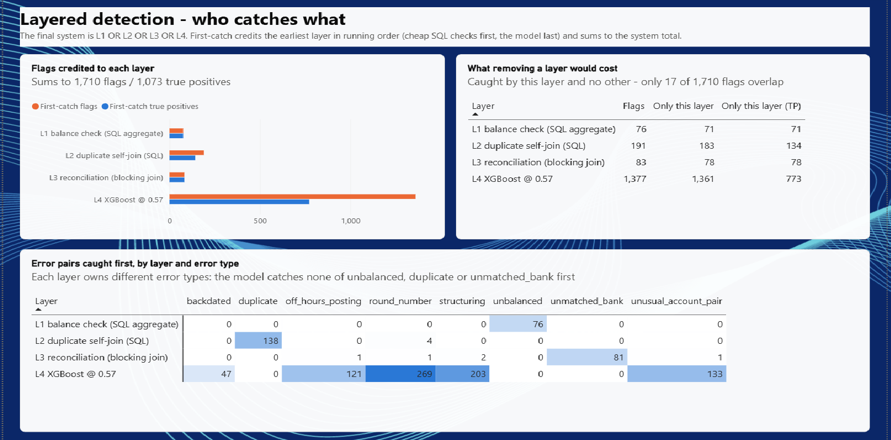
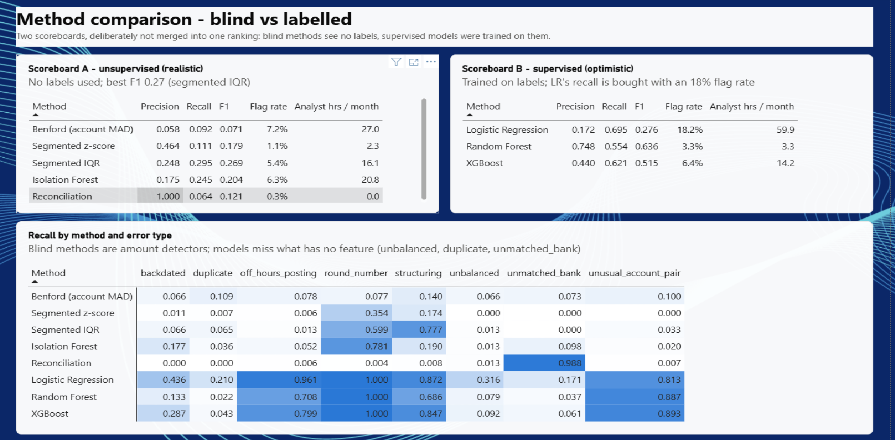
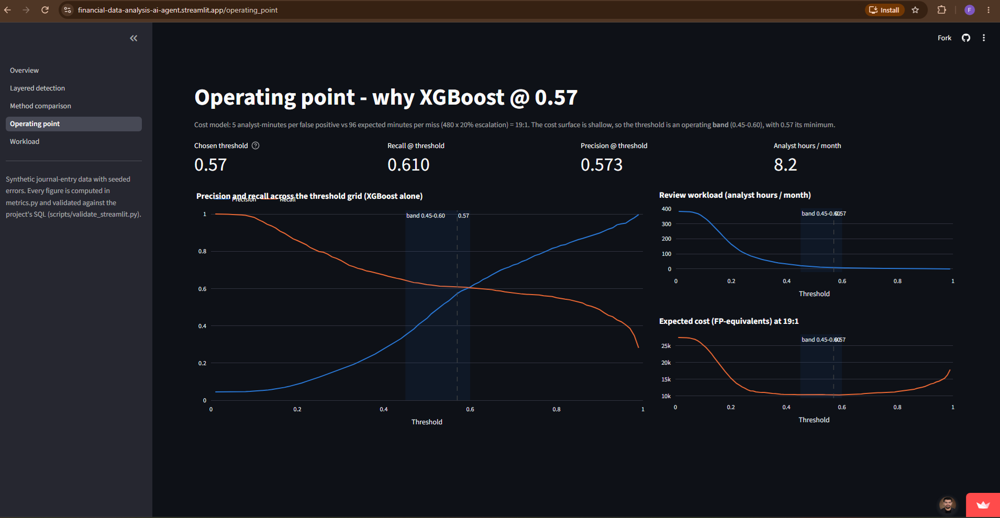

# Journal Entry Anomaly Detection

**Live demo:** https://financial-data-analysis-ai-agent.streamlit.app/

Detecting posting errors in a general ledger with SQL rules, statistical methods, bank reconciliation and supervised models, each scored against known ground truth. **All data is synthetic**: a generator creates the ledger and seeds eight types of error into it, so every result can be checked against the right answer.

*The repository is named `Financial-Data-Analysis-AI-Agent` because a later phase plans an LLM layer that explains flagged entries (see Future work). The current code has no agent or LLM in it.*



## The problem

At month-end close, accountants post and review thousands of journal entries against a deadline. Errors such as duplicated postings, entries that don't balance, amounts split to stay under an approval limit, or entries backdated into a closed period look like ordinary entries, and reviewers can only sample a small share. The question here is which detection methods catch which kinds of error, and at what review cost.

## Results at a glance

The final system runs three SQL checks and an XGBoost model at threshold 0.57, and flags an entry if any of them fires. It was scored on the **test split: the last 6 of 24 fiscal periods, 28,695 journal entries**, of which 1,293 (4.51%) contain a seeded error.

| Metric | Final layered system | XGBoost alone at 0.57 (the same model, without the SQL layers) |
|---|---:|---:|
| Recall | **0.830** | 0.610 |
| Precision | **0.627** | 0.573 |
| F1 | **0.715** | 0.591 |
| Entries flagged | **1,710** (6.0% of the test split) | 1,377 |
| Analyst hours per month (5 min per false alarm) | **8.8** | 8.2 |

The two columns differ only by the three SQL layers. Those layers add 333 flags, 284 of them real errors, which lifts recall by 0.22 and precision by 0.05 for about 0.6 extra analyst-hours a month. Seven of the eight error types are caught with recall of 0.79 or better. The exception is backdated entries (see Key findings).

## Key findings

1. **A data leak was found and fixed, and another was designed out from the start.** The structuring error routine appended `" (split n/m)"` to the entry description. Because the models could read `description_length`, they scored 1.000 recall on structuring, a "hard" error type, and `description_length` ranked #3 in SHAP importance. After removing the suffix and regenerating the data with the same seed, structuring recall fell to 0.864 / 0.682 / 0.868 (logistic regression / random forest / XGBoost). Separately, every history-based feature, including the per-account amount z-score, is computed with an expanding window ordered by posting time. That way a training-period entry can never see test-period amounts.
2. **Cross-checking Power BI against SQL found a bug in the stored evaluation table.** Validating the DAX measures against SQL showed the stored per-error-type scoreboard reporting reconciliation recall of **1.037** (85 caught out of 82). The cause was a pandas index lookup that counted entries carrying two error labels twice. The notebook's own consistency check had missed it because it never read those rows back. The figures reported in the notebook were unaffected; the table was fixed, and the check now covers every per-slice row.
3. **Bank reconciliation needs no labels to be almost exact.** Treating "no bank transaction within one cent and 0–3 days" as the flag gives **precision 1.000 and recall 0.988** on unmatched bank items. Every model scored 0.171 or lower on the same error type.
4. **The layers catch different errors.** Only **17 of 1,710** flagged entries are caught by more than one layer. The balance check catches the unbalanced entries, the duplicate self-join the duplicates, reconciliation the unmatched bank items, and XGBoost the rest. Adding the three SQL layers to XGBoost (both at threshold 0.50) raised recall from 0.621 to 0.835 **and** precision from 0.440 to 0.502.
5. **Backdated entries are the gap left.** The final system's recall on backdated entries is **0.260**. The generator deliberately makes 17.5% of them undetectable, which caps recall on the hard tier at 0.838. The best any method reached on that tier was 0.346 (logistic regression). Closing the gap needs features the feature table doesn't have yet (see Future work).

## Approach



Cleaning, joins and feature building are done in SQL with window functions. Python is used only for the statistical tests, the models and the evaluation.

| Method | Uses labels? | What it does | Best at |
|---|---|---|---|
| Balance check (SQL `GROUP BY … HAVING`) | No | Flags entries where debits ≠ credits | Unbalanced: recall 1.000 |
| Duplicate self-join (SQL) | No | Same employee, accounts and amount within 5 days | Duplicate: recall 1.000 |
| Bank reconciliation (SQL blocking + `rapidfuzz`) | No | Matches ledger cash lines to a messy bank feed | Unmatched bank items: precision 1.000, recall 0.988 |
| Benford's Law | No | First-digit test per account | Finding deviating accounts (not individual entries) |
| Segmented z-score / IQR | No | Amount outliers within each account | IQR: recall 0.599 on round-number, 0.777 on structuring |
| Isolation Forest | No | General-purpose outlier score | Round-number amounts |
| Logistic regression / random forest / XGBoost | Yes | Trained on the first 18 periods, tested on the last 6 | Round-number, off-hours posting, unusual account pairs, structuring |

## Evaluation

- **Two scoreboards, never merged.** Scoreboard A covers the methods that never see labels, which is the realistic estimate: the best is segmented IQR, with F1 0.269. Scoreboard B covers the models trained on labels, which is an upper bound: XGBoost reaches average precision 0.638, about 3× the best blind method. Because the models learn from the generator's labels, they can learn its seeding rules rather than the errors themselves.
- **Recall is counted per (entry, error type) pair.** A few entries carry two error types and count once for each, so per-type recall isn't distorted.
- **The threshold is chosen by cost, not by F1.** The model: a false alarm costs 5 analyst-minutes to review, and a missed error costs 480 minutes × a 20% chance it escalates = 96 minutes. That is roughly **19:1**, and it picks **threshold 0.57** (XGBoost alone: recall 0.610, precision 0.573, 8.2 analyst-hours per month).
  - The expected cost is nearly flat between **0.45 and 0.60**. Realigning one feature moved the optimum from 0.46 to 0.57 while average precision moved by 0.001. So 0.57 is reported as a point inside an operating band, to be reviewed against the actual workload, not as an exact constant.
  - Without the 20% factor (96:1), the optimum drops to 0.10 and flags 91% of the ledger.
  - The F1-optimal threshold (0.79) implicitly prices a missed error at about 31 minutes.
  - At 0.57, XGBoost flags 4.8% of entries, inside a 5% review budget.

## Validation

Every dashboard number is checked against SQL computed straight from the `eval_*` tables:

- **Power BI:** of the 24 DAX measures, 21 are compared directly with SQL by [`scripts/validate_dax.py`](scripts/validate_dax.py). Result: **0 mismatches**, across 16 methods, 16 × 8 per-type cells, the detectability tiers, the operating point and layer attribution. Of the other three, F1 and Flag Rate are calculated only from measures that are checked, and the last is a guard that blanks results when more than one method is selected. The comparison for each measure is recorded in [`powerbi/dax_notes.md`](powerbi/dax_notes.md).
- **Streamlit:** [`scripts/validate_streamlit.py`](scripts/validate_streamlit.py) checks every function in `streamlit_app/metrics.py` against the same SQL queries. Result: **842 checks, 0 mismatches**, with counts matched exactly and ratios to 3 decimal places. To test the checker itself, faults were injected on purpose (a wrong cost constant, and one per-type count off by one); both were caught.

## Dashboards

- **Power BI**, in [`powerbi/anomaly_detection.pbip`](powerbi/): five pages (Overview, Layered detection, Method comparison, Operating point, Review workload). The report is stored as PBIR text files generated by [`scripts/build_report.py`](scripts/build_report.py), so layout changes show up in version control. Every visual shows one method at a time, because scores from different methods aren't comparable.
- **Streamlit**, [live demo](https://financial-data-analysis-ai-agent.streamlit.app/): the same five pages in Plotly. The app reads a 2.7 MB Parquet snapshot, so it needs no database. Employee names are pseudonymised when the snapshot is exported.





## Limitations

1. **The data is synthetic, generated by a known process.** The results show how the methods compare under controlled conditions. They are not performance figures you could expect on a real ledger.
2. **The labels record how each error was seeded, not real fraud.** The supervised models may learn the seeding rule, which is why Scoreboard B is treated as an upper bound.
3. **Backdated recall has a designed ceiling of 0.838**, and current detection (0.260) is far below it.
4. **Reconciliation's text matching is limited by the generator.** The ledger's reference field carries no counterparty text, so string matching alone can't go beyond a certain point.
5. **A data leak was found mid-project, and it had already distorted a conclusion.** The structuring routine's `" (split n/m)"` suffix leaked through the `description_length` feature, which ranked #3 in SHAP importance. The Phase 3 EDA hypothesis was that behavioural signal would outrank structural signal, and the leaked feature made it look confirmed. After the fix, the top of the ranking is a three-way contest: `user_account_frequency` (behavioural) first, then `account_pair_frequency` (structural) and `total_amount` (amount) at #2 and #3. So the hypothesis is only partly confirmed.
6. **Behavioural features mostly describe a few people.** 39 employees post entries, and the top 15 make 88.6% of them.
7. **One split, one random seed, no confidence intervals.** Differences of a point or two between methods are not meaningful.
8. **The unsupervised methods were fitted on the whole ledger, test period included.** That's standard for unsupervised detection, but it means Scoreboard A isn't strictly out-of-sample.

## Repository structure

```
data/            generate_journal_entries.py - synthetic ledger + seeded errors (RNG_SEED = 42)
sql/             00 sanity checks, 01 schema, 02 feature table, 03 evaluation output tables,
                 backdated_hard_tier_signal.sql (the analysis behind the backdated design)
notebooks/       01_eda, 02_methods, 03_reconciliation, 04_supervised, 05_evaluation
powerbi/         anomaly_detection.pbip (PBIR report + TMDL model), dax_notes.md
scripts/         validate_dax.py, build_report.py, export_parquet.py, validate_streamlit.py
streamlit_app/   app.py, metrics.py, pages/, data/*.parquet
```

## How to reproduce

Prerequisites: PostgreSQL, Python 3.14 (the Streamlit app alone also runs on 3.13), and Power BI Desktop (for the report only).

1. Copy `.env.example` to `.env` and fill in the Postgres connection details. The scripts and notebooks read the standard `PG*` variables.
2. Install the dependencies. The root `requirements.txt` covers the generator, notebooks, scripts and app: `pip install -r requirements.txt`
3. Create the schema: `psql -f sql/01_schema.sql`
4. Generate the data: `python data/generate_journal_entries.py` (`--dry-run` generates and validates without writing to the database)
5. Check the data: `psql -f sql/00_sanity_checks.sql`
6. Build the features: `psql -f sql/02_features.sql`
7. Run the notebooks in order, `01` → `05`. Notebook 05 runs `sql/03_eval_outputs.sql` itself and fills the `eval_*` tables.
8. Validate:
   - `python scripts/validate_dax.py` (Power BI; its docstring lists the DAX queries to run)
   - `python scripts/validate_streamlit.py` (Streamlit)
9. Dashboards:
   - Power BI: open `powerbi/anomaly_detection.pbip`.
   - Streamlit: see Run locally below.

### Run locally (Streamlit only, no database needed)

```bash
pip install -r streamlit_app/requirements.txt
streamlit run streamlit_app/app.py
```

After any change to the Postgres results, refresh the snapshot: run `python scripts/export_parquet.py`, then `python scripts/validate_streamlit.py`, then commit `streamlit_app/data/`.

## Tech stack

PostgreSQL (window functions, `jupysql` notebooks) · Python: pandas, scipy, scikit-learn, XGBoost, SHAP, rapidfuzz · Power BI (DAX, TMDL, PBIR) · Streamlit + Plotly

## Future work

- **Backdated features:** compare each entry's posting lag against the poster's own history instead of one global threshold, and model how the three risk drivers (manual entry, after-hours posting, period-end posting) combine rather than treating them independently.
- **LLM explanation layer:** plain-language explanations of *why* an entry was flagged, for the reviewer. It would be kept separate from detection: it would never change a flag or a reported metric, and every figure above would stay a detection result.
